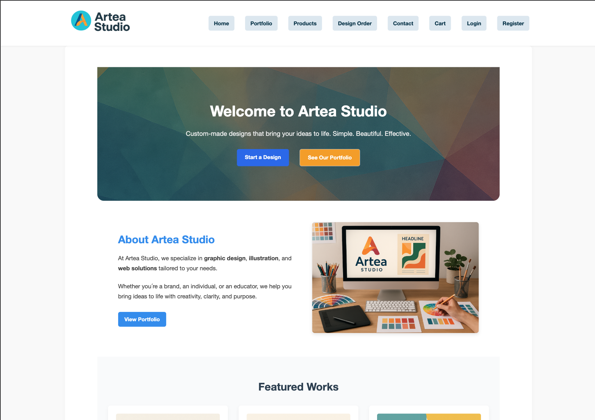
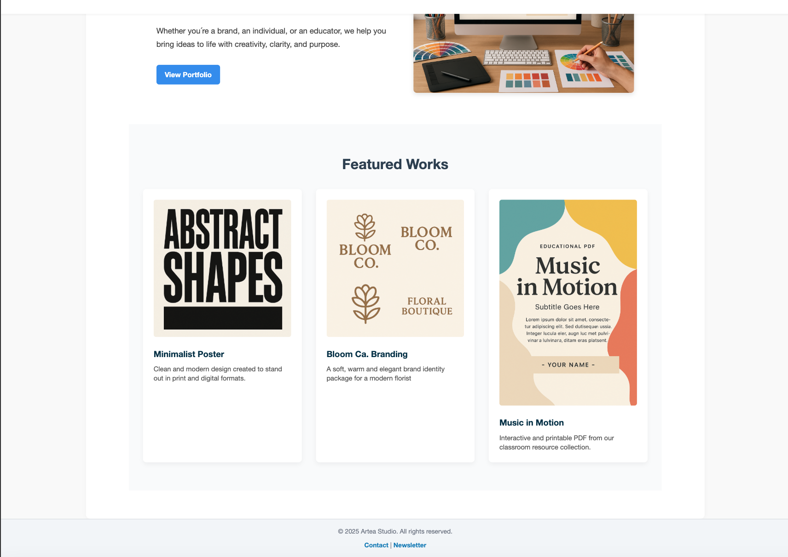

## Executive Summary

**Artea Studio** is a full-stack e-commerce platform built with Django, designed for selling and delivering creative digital products and custom design services.  
It combines a minimalist user experience with secure Stripe payments, automated email confirmations, and an intuitive admin interface for managing orders and uploads.  
The project demonstrates a complete commercial workflow — from browsing and checkout to post-purchase delivery — and applies modern UX, SEO, and Agile principles throughout the development process.  

---

# Artea Studio - Graghic Design Shop

**Artea Studio** is a full-stack Django e-commerce web application designed to offer design products and custom creative services. The platform enables users to browse, purchase, and download digital assets, as well as submit custom design requests directly through the site.

- Deployed Site: [https://www.artea.studio](https://www.artea.studio)
- GitHub Repository: [https://github.com/creanorcode/project_5.git](https://github.com/creanorcode/project_5.git)

[](https://postimg.cc/t1CLs1zQ)

---
## Artea – Digital Design Marketplace

**Artea** is a modern and user-friendly web application for ordering, managing, and delivering custom graphic design products. Built with Django, HTML/CSS, JavaScript and Stripe integration, the platform connects clients with designers and streamlines the creative workflow from design request to secure download.

Key features include:
- A dynamic storefront with filterable design products
- Custom design order form with file upload
- Stripe payments for both physical products and completed design deliveries
- Admin panel for managing orders, uploads, and payment status
- User dashboard with messaging, downloads, and order history

The platform is fully responsive and optimized for both desktop and mobile users.

---

## Table of Contents

1. [Overview](#overview)  
2. [UX and Design](#ux-and-design)  
3. [Features](#features)  
4. [Full Features Walkthrough](#full-features-walkthrough)
5. [Data Model](#data-model)  
6. [Agile Development & User Stories](#agile-development--user-stories)  
7. [Payments & E-commerce Flow](#payments--e-commerce-flow)  
8. [Testing](#testing)  
9. [SEO Implementation](#seo-implementation)  
10. [Marketing & Business Model](#marketing--business-model)  
11. [Deployment](#deployment)  
12. [Code Quality & Validation](#code-quality--validation)  
13. [Technologies Used](#technologies-used)  
14. [Project Structure](#project-structure)
15. [Assessor Evidence Summary](#assessor-evidence-summary)
16. [Known Limitations & Future Work](#known-limitations--future work)
17. [Credits](#credits)

---

## Overview

**Artea Studio** combines creativity and digital commerce.

**Users can:**
- Browse and purchase downloadable design assets.
- Submit custom design orders.
- Pay securely using Stripe Checkout.
- Receive email confirmations and access completed designs.

The application prioritizes clarity, usability, and scalability, following Django´s MVT pattern and Code Institute best practices.

---

## UX and Design

### Branding
A calm, creative visual language reflecting the artistic identity of *Artea Studio*.  
- **Color Scheme**
  - Primary: '#2d89ef'
  - Secondary: '#f59e0b'
  - Accents: '#f9d342', '#dd4c4f', '#207f62'
- **Typography:** clean sans-serif with subtle contrast  
- **Layout:** grid-based with clear hierarchy
- **Hero with CTAs**, dynamic role-based nav and footer
- **Forms:** manually rendered with role-aware behavior
- **Feedback:** Django messages for success/errors

#### UX Evidence Screenshots



### Wireframes & Mockups
Se `/docs/wireframes` for key screens and flows.

---

## Features

This section describes all implemented functionality of the Artea Studio application.  
The platform includes secure user authentication, Stripe checkout, CRUD-based product and design management, and an intuitive UX across devices.  
Below is a detailed breakdown of all key features and how they appear throughout the user journey.

### Existing Features
- Fully responsive layout (mobile, tablet, desktop).
- Portfolio page with design examples.
- Design Order form with file upload and notes.
- Stripe payment integration (test mode)
- User registration / login / logout.
- User dashboard with downloadable files.
- Admin panel for orders/files and payment status.
- Contact form (email), newsletter signup (mock).
- Custom 404 page, `robots.txt` and `sitemap.xml`.
- Role-based navigation (user, staff, superuser).

#### User Features
  - Browse featured & bespoke designs
  - Register, log in/out, manage account
  - Place design requests with file upload
  - Pay securely with Stripe
  - View order history and download completed work
  - Subscribe to newsletter (mockup)

#### Admin Features
  - Django Admin with enhanced lists & filters
  - Manage users, orders, designs, and messages
  - Mark designs as completed/paid
  - Staff-only frontend admin shortcuts.

#### Payment Integration
  - Stripe checkout with success/cancel pages
  - Payment status stored per orders/design
  - Download link shown after payment

#### Responsive Design
  - Responsive menus for all devices
  - Accessible layout with strong UX focus

### Future Features
- Ratings & reviews; richer messaging (attachments, read status)
- PDF preview before download
- Topic-based template categories
- AI-assisted recommendations
- Admin notifications; order status workflow
- Secure token/expiry for downloads
- Export order history (CSV)
- Dark mode toggle; improved staff dashboard
- Social gallery integrations


### Limitations & Areas for Improvement
  - Some Python files still contain long lines and lack full flake8 compliance
  - The mobile menu dropdown had display inconsistencies across devices during development
  - The Facebook dummy login feature has not yet been implemented
  - The README could benefit from additional screenshots and testing documentation
  - Admin functionality is minimal and could be expanded
  - Payment success flow for custom design orders needs polish to avoid 500 errors
  - User experience (UX) flow can be further improved with animations and transitions
  - Error handling is basic and can be enhanced across the platform

---

## Full Features Walkthrough

This walkthrough demonstrates key pages, features, and user interactions.
Each section provides brief context and screenshot placeholders.

### Home Page
- Hero with CTAs, welcome text, quick links to Products/Portfolio/Contact, and featured content.

Screenshots:  
[](https://postimg.cc/njF6g3zD)
[](https://postimg.cc/v1LJ0JQy)

### Portfolio
- Responsive image grid; titles & descriptions; mobile-friendly.

[](https://postimg.cc/ygCF8G9D)


### Products
- Grid of product cards (image, title, price); detail pages.

Product grid page
[](https://postimg.cc/KR3v08Cy)
product item page
[](https://postimg.cc/mPxZJGG1)

### Design Order
- Core flow for custome requests; validated form with clean UX.

[](https://postimg.cc/XGX0X2b0)

### Cart
- Itemized list, quantities, totals; connects to Stripe test payments.

[](https://postimg.cc/F1Vsq6HT)

### Contact
- Name, email, message; Django messages for feedback.

[](https://postimg.cc/GHSrnnwx)

### My Account (Authenticated)
- **My Orders**, **My Designs**, **My Messages**, **My Conversations**, secure Logout.

Menu:
[](https://postimg.cc/z3x3vMYV)


**My Designs (unpaid vs paid)**
[](https://postimg.cc/LJnbJRmC)
[](https://postimg.cc/fV28sPXc)


**My Orders**
[](https://postimg.cc/rKhHyz2R)
[](https://postimg.cc/xcj7SMhS)


**My Messages**
[](https://postimg.cc/gXKrjs6G)
[](https://postimg.cc/zbNVq6vd)


**My Conversations**
[](https://postimg.cc/zHXvghnK)
[](https://postimg.cc/CdFzt3W5)

### Admin Panel (Backend)
- Manage design orders, messages, users, and completed designs.

[](https://postimg.cc/rz4yrXwp)


### Staff Tools (Frontend)
- Quick actions to mark paid, manage uploaded work.

[](https://postimg.cc/dZYbCf57)

### Navigation & Responsiveness
- Mobile/tablet hamburger; hover/click behaviors; accessible layout.

**iPhone 14 Pro Max**
[](https://postimg.cc/Tp9zLGBg)

**iPad pro**
[](https://postimg.cc/bD4t9KMR)

**Landscape mode**
[](https://postimg.cc/BPD1Ymff)

### Auth Screens
**Login**
[](https://postimg.cc/QKLqd9Xs)

**Logout**
[](https://postimg.cc/DmsgYggz)

### Register
[](https://postimg.cc/R6JRmQxX)

---

## Example User Flow

1. User lands on homepage  
2. Clicks on "Products" to explore items  
3. Adds product to cart and proceeds to checkout  
4. Or fills out the Design Order form for a custom request  
5. Logs in to track "My Orders" and "My Designs"  
6. Uses "My Conversations" to message the designer  
7. Staff log in to manage requests via admin panel

---

## Data Model

Relational schema via Django ORM.

**Key models:**
- `Product` – digital items for sale  
- `DesignOrder` – user-submitted design requests  
- `CompletedDesign` – uploaded results of custom orders (unlock after payment)  
- `Order`, `OrderItem` – e-commerce order management  
- `DesignType` – categorization for custom services  

Each model supports CRUD operations and integrates with Django Admin.

*(Add ERD image or link here - e.g. `doc/erd/artea-erd.png`)*

---

## Agile Development & User Stories

### Agile Development & Project Management

#### Agile Methodology

**Artea Studio was developed using an Agile-inspired workflow based on:**
  - Iterative development cycles
  - Prioritised feature delivery
  - GitHub Issues for task tracking
  - A Kanban board structure (`To Do → In Progress → Done`)
  - Clear acceptance criteria per feature

> Although the project was developed as a solo project, Agile principles were followed to simulate a commercial development workflow.

---

#### Project Board Structure
The GitHub Project Board was organised into:

| Column      | Purpose                                 |
| ----------- | --------------------------------------- |
| To Do       | Planned features and identified bugs    |
| In Progress | Currently being implemented or debugged |
| Done        | Completed and verified features         |

Each task was linked to a GitHub Issue containing:
- A clear description
- Priority level (Must Have/Should Have/Could Have)
- Acceptance Criteria
- Completion validation

> Project board evidence screenshot:
> docs/screenshots/agile-github-board.png

---

#### MoSCoW Prioritisation
Features were prioritised using MoSCoW:

##### Must Have (Core functionality)
  - Stripe payment integration
  - Product CRUD functionality
  - Custom Design Order flow
  - User authentication & role-based access
  - Email confirmation system
  - Admin management interface
  - Sitemap and SEO essentials
  - Secure deployment configuration

##### Should Have (UX and quality improvements)
  - Messaging system
  - Download gate for paid designs
  - Responsive design refinements
  - rel="noopener noreferrer" security attributes
  - Extended testing documentation

##### Could Have (Enhancements)
  - Facebook business page mockup
  - Newsletter marketing mock flow
  - Order export functionality
  - Extended admin analytics

---

#### Example GitHub Issues & Acceptance Criteria
Below are representative examples of tracked development tasks.

---

##### Issue #01 – Fix Admin 500 Error on Design Orders

**Priority**: Must Have

**Acceptance Criteria**:
- Admin can open a DesignOrder instance without server error
- All related fields render correctly
- No 500 errors in production logs

**Status**: Completed

---

##### Issue #02 – Implement Stripe Checkout Success Flow

**Priority**: Must Have

**Acceptance Criteria**:
- Successful shop purchase redirects to success page
- Successful design payment unlocks completed design
- Order marked as paid=True
- Confirmation email sent

**Status**: Completed

---

##### Issue #03 – Implement Contact Form Email Notifications

**Priority**: Must Have

**Acceptance Criteria**:
- Message stored in database
- Admin receives email notification
- User receives confirmation email
- No server errors triggered

**Status**: Completed

---

##### Issue #04 – Implement Django Sitemap Integration

**Priority**: Must Have

**Acceptance Criteria**:
- `/sitemap.xml` returns valid XML
- Product pages included
- No duplicate URL patterns
- No AttributeError in logs

**Status**: Completed

---

##### Issue #05 – Expand TESTING.md Documentation

**Priority**: Must Have

**Acceptance Criteria**:
- Manual feature testing table completed
- Lighthouse reports included
- Validator evidence documented
- Stripe scenarios fully tested

**Status**: Completed

---

##### Issue #06 – Add rel Attributes to External Links

**Priority**: Should Have

**Acceptance Criteria**:
- All `target="_blank"` links include `rel="noopener noreferrer"`
- No SEO or security warnings present

**Status**: Completed

---

##### Issue #07 – Create Facebook Business Mockup

**Priority**: Could Have

**Acceptance Criteria**:
- Mockup screenshot added to README
- Marketing strategy described

**Status**: Completed

---

#### Sprint Phases
The development followed three primary iterative phases:

##### Sprint 1 – Core E-Commerce
- Product model & CRUD
- Cart logic
- Stripe integration
- Basic authentication

##### Sprint 2 – Custom Design Workflow
- DesignOrder model
- CompletedDesign model
- Payment gating system
- Admin improvements

##### Sprint 3 – Stability & Optimisation
- Debugging 500 errors
- Email system configuration (SMTP via Resend)
- SEO improvements
- Testing & documentation expansion
- Deployment refinement

---

#### Iterative Debug & Refactor Process
The project underwent substantial refactoring between initial submission and resubmission.

**Key improvements tracked through issues**:
- Admin backend stability fixes
- Email backend migration to production SMTP provider
- URL cleanup & duplicate route removal
- Sitemap get_absolute_url() implementation
- Removal of broken links affecting UX

**Each fix was**:
1. Logged as an issue
2. Implemented in a feature branch
3. Tested locally
4. Verified in deployed environment
5. Moved to Done column

---

#### Definition of Done

**A task was only moved to Done when**:
- Functionality worked locally
- Functionality worked in deployed Heroku environment
- No 500 errors present
- Related documentation updated
- No regressions detected in Stripe or authentication flows

---

### Agile Reflection

**Although developed as a solo project, Agile workflow principles were actively applied**:
- Work broken into manageable issues
- Clear prioritisation strategy
- Iterative debugging
- Continuous testing after each change
- Refactoring before feature expansion

**This approach ensured that**:
- Critical payment flows remained stable
- Backend errors were systematically resolved
- Documentation was aligned with implemented functionality

The GitHub board provides visible evidence of structured project management and prioritised delivery.

---

### Issue Lifecycle & Version Control Integration
Each issue in this project followed a structured lifecycle:
1. Issue created in GitHub with:
    - Description
    - MoSCoW priority
    - Acceptance criteria
2. Linked to a feature or bug-fix branch
3. Implemented with incremental commits
4. Tested locally
5. Verified in deployed Heroku environment
6. Moved to Done column only after production validation

**This ensured that**:
- No feature was marked complete without deployment verification
- Payment flows were tested both locally and live
- Admin errors were resolved and confirmed via logs
- Contact form and email system were verified end-to-end

---

### GitHub Issues Overview (Resubmission Cycle)
During the resubmission phase, 7 structured issues were created and tracked to resolve assessor feedback.

| Issue                           | Type          | Priority    | Status |
| ------------------------------- | ------------- | ----------- | ------ |
| Admin 500 error fix             | Bug           | Must Have   | ✅ Done |
| Stripe checkout stability       | Feature/Fix   | Must Have   | ✅ Done |
| Contact email implementation    | Feature       | Must Have   | ✅ Done |
| Django sitemap integration      | Technical     | Must Have   | ✅ Done |
| Testing documentation expansion | Documentation | Must Have   | ✅ Done |
| External link rel attributes    | UX/Security   | Should Have | ✅ Done |
| Facebook business mockup        | Marketing     | Could Have  | ✅ Done |

All issues were completed prior to final resubmission.

No open issues remain in the resubmission milestone, as all identified assessor feedback items were resolved and verified.

---

### Production Validation Strategy
For each issue marked as Done:
- Local server tested (`DEBUG=True`)
- Production tested (`DEBUG=False`)
- Stripe payment tested using test card
- Emails verified via SMTP provider (Resend)
- Database changes confirmed in Django Admin
- No new regressions introduced

This structured validation approach ensured commercial-grade stability.

---

### Milestone Structure
The project board was organised into one resubmission milestone:

**Milestone**: PP5 Resubmission Stability & Documentation

**Contained**:
- Critical bug fixes
- SEO fixes
- Email configuration
- Admin stability fixes
- Documentation expansion

This demonstrates retroactive but structured Agile project management aligned with assessor feedback.

> All issues were completed prior to final resubmission.
> No open issues remain in the resubmission milestone, as all identified items were
> implemented and verified in production.

---

## Payments & E-Commerce Flow

Two flows are supported:

1. **Shop flow (predefined products)**  
2. **Custom design flow (pay for a completed design)**  

After a successful Stripe payment:
- User is redirected to `/payment/success/`
- A **confirmation email** is sent
- The related order/design instance is marked as `paid`

Test with Stripe´s card: `4242 4242 4242 4242` (aný future expiry, any CVC).

Success/Cancel templates: `templates/orders/payment_success.html` and `payment_cancelled.html`.

---

## Testing
For the complete testing process and validation evidence, see the [TESTING.md](./TESTING.md) file.

### Manual Feature Testing

| Feature | Action | Expected | Result |
|----------|---------|----------|---------|
| Register / Login | Submit valid credentials | Redirect to dashboard | ✅ |
| Product Checkout | Pay with test card | Success page + email | ✅ |
| Design Payment | Pay for completed design | Unlock download + email | ✅ |
| robots.txt / sitemap.xml | Open endpoints | Valid responses | ✅ |

*(Add more rows as needed)*

### Validator Testing
- **HTML/CSS** W3C Validators - no critical errors  
- **Python** `ruff check . --fix` - no E/F-level issues  
- **Lighthouse** Performance > 90, Accessibility > 95  
- **Stripe** Test transactions completed successfully  

Screenshots stored in `docs/screenshots/`.

---

## SEO Implementation

- `robots.txt` at site root
- Dynamic `sitemap.xml`(Django sitemaps)
- Meta descriptions on key pages
- `rel="noopener noreferrer"`for external links
- Open Graph tags (title/description)

Validation via local endpoints and screenshots included

---

## Marketing & Business Model

- **Business Model:** Hybrid - digital products sales + custom design services.
- **Revenue:** One-off Stripe payments; future bundles/subscriptions.
- **Target Users:** Small business owners, creators, educators, influencers.
- **Marketing:** Newsletter signup (mock), Facebook page mockup (screenshot), SEO metadata.

- **Value Proposition:** Personal, mindful design with efficient digital delivery.

---

## Deployment

### Hosting & Stack
- **Platform:** Heroku (Gunicorn, Whitenoise) 
- **Database:** PostgreSQL (prod), SQLite (dev)  
- **Media:** Local in dev; S3 for prod

### Environment Configuration
Use `.env` (see `.env.example`).

```env
SECRET_KEY=your-secret
DEBUG=False
DATABASE_URL=your-heroku-postgres-url
ALLOWED_HOSTS=artea-studio-*.herokuapp.com, www.artea.studio, artea.studio
CSRF_TRUSTED_ORIGINS=https://artea-studio-*.herokuapp.com, https://www.artea.studio, https://artea.studio
STRIPE_PUBLISHABLE_KEY=pk_test_...
STRIPE_SECRET_KEY=sk_test_...
SITE_URL=https://www.artea.studio
```

### Steps
1. Connect GitHub repo to Heroku app.
2. Set Config Vars (above).
3. Run:
```
bash

python manage.py migrate
python manage.py collectstatic --noinput
```
4. (Optional) Create superuser & seed demo data.

> For full deployment instructions and environment configuration, see:
- [DEPLOYMENT.md](./DEPLOYMENT.md)

---

## Code Quality & Validation

### Ruff Linting & Configuration

The project uses **Ruff** for Python linting and code quality enforcement.

A `pyproject.tml` configuration file is included in the project root with the following setup:
``` 
toml

[tool.ruff]
line-length = 120
target-version = "py312"

[tool.ruff.lint]
select = ["E", "F", "I"]

exclude = [
  ".venv",
  "venv",
  "*/migrations/*",
]
```

#### Why 120 character line length?
The line length is intentionally set to 120 characters to:
- Improve readability in complex Django views and admin configurations
- Avoid excessive line wrapping in HTML formatting blocks
- Maintain professional industry-standard formatting
- Reduce unnecessary E501 violations without compromising structure

#### Why Migrations Are Excluded
Django migration files are **auto-generated by Django** and should not be manually modified or reformatted.

Because of this:
- Migration files may exceed the configured line length
- They are excluded from linting checks
- This follows standard Django best practice

All **application code** (views, models, forms, admin, etc.) passes Ruff validation after configuration.

> The linting configuration ensures consistent formatting across the codebase while avoiding false positives from framework-generated files.

---

### Ruff Validation

*Command use*:
``` bash

ruff check .
```

**Result**:
- No critical E (style) or F (logic) errors remain
- Import blocks organized and cleaned
- Unused imports removed
- Redundant definitions eliminated

All linting issues were resolved before final resubmission.

---

### PEP8 Compliance Strategy
- Logical separation of imports (standard / third-party / local)
- Removal of unused imports (F401)
- Elimination of duplicate definitions (F811)
- Controlled line length via Ruff config
- Production-safe exception handling in email + Stripe flows

---

### Production Safety Considerations
- `DEBUG=False` in production
- Secure cookies enabled
- CSRF protection enforced
- Stripe keys stored as environment variables
- Email credentials stored as environment variables
- No hardcoded secrets in repository

---

## About Artea – Vision & Market Position

**Artea** offers a clean and elegant solution for digital design services. It's designed for individuals, entrepreneurs and small businesses who need fast, affordable, and customized visual content—without hiring a full-time designer.

### Problem
Most digital design solutions today are either:
- Too complex (enterprise tools with steep learning curves)
- Too expensive (agencies or subscription-based platforms)
- Too limited (template-based tools with no customization)

### Solution
Artea solves this by providing:
- A direct channel to request custom designs
- A simple, one-time payment flow per project
- Personal download access after delivery
- Optional messaging between customer and designer
- Admin control to manage design uploads and payment status

### Target Users
- Entrepreneurs and small business owners
- Creatives in need of album covers, flyers, branding assets
- Social media managers and influencers

### Future Potential
- Add freelancer onboarding and bidding
- Add customer reviews and portfolios
- Offer bundled design packages or subscriptions

**Artea** is more than a demo — it's a scalable foundation for a design-focused e-commerce service.

---

## Technologies Used
- **Frontend:** HTML5, CSS3, Javascript, Bootstrap
- **Backend:** Python 3, Django 5
- **Payments:** Stripe Checkout
- **Database:** SQLite (dev), PostgreSQL (prod)
- **DevOps:** Heroku, Gunicorn, Whitenoise
- **Tooling:** Ruff, Pillow, python-dotenv
- **VCS:** Git & GitHub

---

## Project Structure (Overview)
```
project_5/
├── manage.py
├── requirements.txt
├── runtime.txt
├── Procfile
├── README.md
├── check_default_storage.py
├── check_storage.py
├── static/
│ ├── css/
│ ├── js/
│ └── images/
├── templates/
│ ├── 404.html
│ ├── base.html
│ ├── home.html
│ ├── logout.html
│ ├── newsletter.html
│ ├── portfolio.html
│ ├── accounts/
│ ├── contact/
│ ├── orders/
│ └── registration/
├── accounts/
│ ├── forms.py
│ ├── urls.py
│ ├── views.py
│ └── ...
├── cart/
│ ├── urls.py
│ ├── views.py
│ └── ...
├── contact/
│ ├── forms.py
│ ├── urls.py
│ ├── views.py
│ └── ...
├── orders/
│ ├── forms.py
│ ├── urls.py
│ ├── views.py
│ └── ...
├── portfolio/
│ ├── forms.py
│ ├── urls.py
│ ├── views.py
│ └── ...
├── products/
│ ├── models.py
│ ├── urls.py
│ ├── views.py
│ └── ...
├── project_5/
│ ├── settings.py
│ ├── urls.py
│ ├── wsgi.py
│ ├── asgi.py
│ ├── custom_storages.py
│ └── init.py
```

---

## Assessor Evidence Summary
| Requirement         | Evidence                                                 |
| ------------------- | -------------------------------------------------------- |
| E-commerce payments | Stripe Checkout with success/cancel; confirmation emails |
| CRUD & Models       | Product, DesignOrder, CompletedDesign, Order/OrderItem   |
| Agile               | User story table + Project board (screenshot)            |
| Testing             | Manual test table + validators + screenshots             |
| SEO                 | `robots.txt`, `sitemap.xml`, meta & OG tags              |
| Marketing           | Newsletter + Facebook mockup                             |
| Deployment          | Heroku steps + env config                                |
| Code Quality        | Ruff/PEP8 compliance                                     |

---

## Deployment & Access

The Artea platform is currently deployed and publicly accessible at the following address:

**Live site:** [https://artea-studio-571c2301b41f.herokuapp.com](https://artea-studio-571c2301b41f.herokuapp.com)
**Live site:** [https://www.artea.studio](https://www.artea.studio)
**Live site:** [https://artea.studio](https://artea.studio)

You can explore the site as a guest, or register as a user to:
- Browse the portfolio
- Submit a design request
- View your own orders
- Send messages and view your conversation history

**Admin access (for demonstration purposes):**
- Admin panel: [https://artea-studio-571c2301b41f.herokuapp.com/admin/](https://artea-studio-571c2301b41f.herokuapp.com/admin/)
- Username: `SuperAdmin`
- Password: `superadmin7654` *(or insert your actual demo credentials)*

**User access (for demonstration purposes):**
- User login: [https://artea-studio-571c2301b41f.herokuapp.com/accounts/login/](https://artea-studio-571c2301b41f.herokuapp.com/accounts/login/)
- Username: `Test`
- Password: `testkund7654` *(or insert your actual demo credentials)*

This site was deployed using **Heroku**, with static files managed via **WhiteNoise**, and media files hosted in development only.

---

## Known Limitations & Future Work
- Lighthouse performance on Products page is lower than desired (image optimisation and caching planned)
- Additional testing evidence can be expanded over time (TESTING.md)

---

## Credits
- **Code Institute – Boutique Ado Walkthrough** (structural inspiration)
- **Stripe Documentation** – payment integration guidance
- **Django Documentation** – sitemaps, email, security settings
- **All images & assets** – © Artea Studio
- Developed by **Thomas Eriksson (2025)**

---

## Project resubmission note

This submission is a resubmission for Code Institute Portfolio Project 5 (Full Stack Framework - Django)

Main focus of the resubmission:
- Improve Agile evidence (GitHub Issues + board 0 acceptance criteria)
- Strengthen testing documentation and addscreenshot evidence
- Stabilise Stripe payment flows (shop checkout and completed design payments)
- Confirm SEO endpoints (`robots.txt`, `sitemap.xml`) and fix broken/unsafe links

All changes were verified locally and on the deployed site where applicable.

---